# AgriWing-100

**A 1-metre, fully 3D-printed flying wing that maps crops in RGB and near-infrared** for plant-health analysis on board, with a Raspberry Pi 5 and two Camera Module 3 units. Designed in Fusion 360, with aerodynamics checked in OpenFOAM, structure checked by hand analysis, and every part audited for assembly and support-free printing.

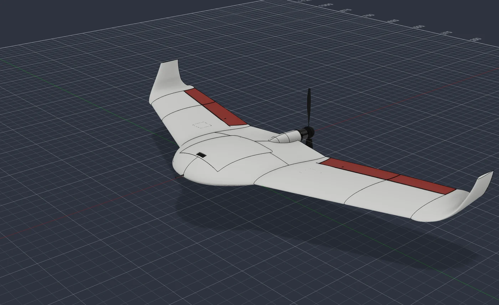

**Full engineering dossier:** <https://caioplcerda.github.io/agriwing-100/>. It covers structure, wing and hinge, the assembly and print audit, CFD, mass and balance, build sequence and test plan.

| | |
|---|---|
| Configuration | Blended wing-body, MH60 reflex airfoil, 20° sweep, 7° washout, blended winglets, pusher prop |
| Size | 1.04 m span, 20 dm² class |
| All-up mass | 1234 g (376 g printed) |
| Cruise | L/D 12.4 (CFD, clean airframe), ≈15.5 m/s |
| Endurance | 55–78 min on a 3S2P Molicel P45B pack |
| Coverage | ≈110 ha per flight at 1.8 cm/px (60 m) |
| Printing | 17 parts, ~32 h, 256 × 256 mm bed, LW-ASA, no supports (a brim on 3 parts) |
| Parts cost | ≈ $536 |

## What Rev D fixed

Rev D applies what the [Dart-80](https://github.com/caioplcerda/dart-80) build taught. The same checks found eight faults in the previous revision, and all of them are fixed.

| Area | Before (Rev C) | Now (Rev D) |
|---|---|---|
| Wing bending across the body | Swept spars ending in the centre body; three M3 inserts on the belly carried the moment (SF ≈ 1.1) | Straight carry-through: Ø6 solid carbon joiner + 8×6 tube per wing (SF 3.2) |
| Wing panels | 0.6 mm shells with ribs | Solid models: the slicer sets walls and infill |
| Elevons | Jammed beyond ±10°; three ribs crossed the elevon; outer half undriven | Round-nose hinge, free to ±30°; Ø2 carbon torque rod couples both halves |
| Spar bore | Blocked inside W2 | Straight, verified end to end |
| Servos | Case 1.4 mm into the cover | Seated 2.4 mm higher |
| Hatch | Front edge free to lift | Hood and tongue lock the front edge |
| Control horn | Printed in foamed plastic | Bonded 1.5 mm G10 |
| Printing | 232 cm² of support under the hatch, bridges over 100 mm | Re-oriented and re-shaped: support-free |

<p align="center">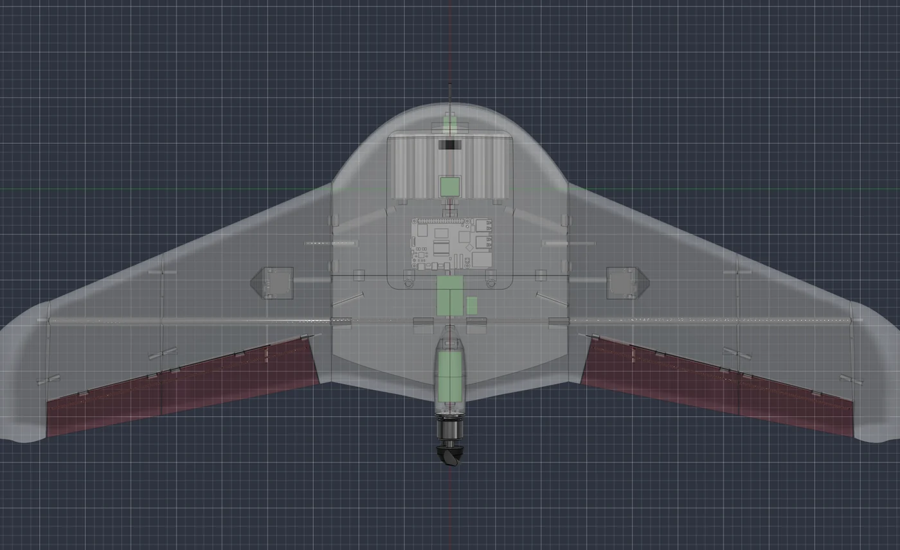 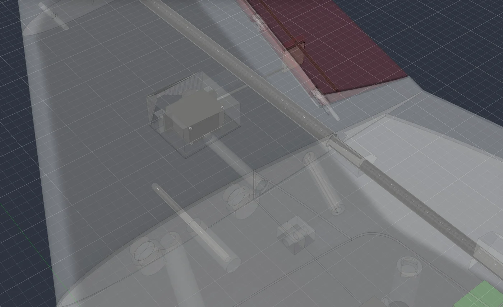</p>

### Hinge that actually moves
The elevon nose is now a cone around the hinge axis that turns inside a matching cove with 0.6 mm clearance. The printed knuckles take a Ø1.75 filament pin.

<p align="center">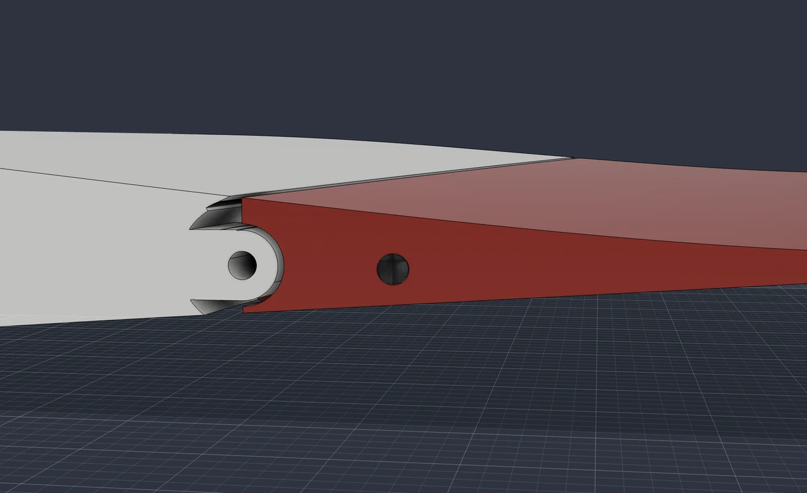 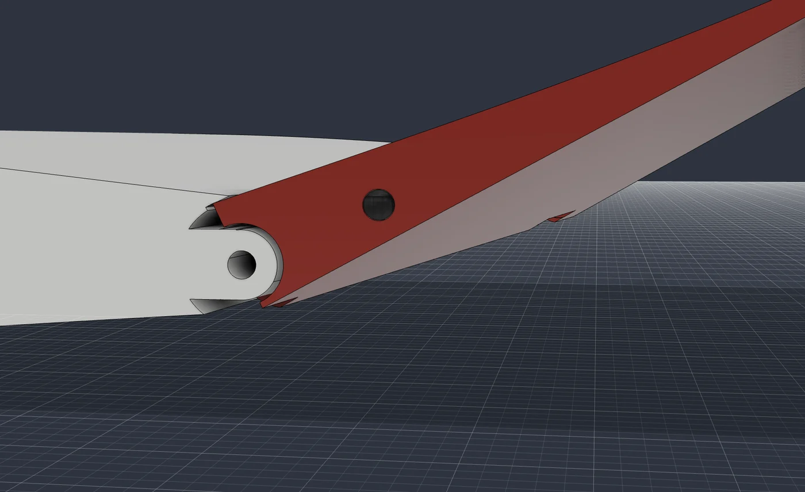 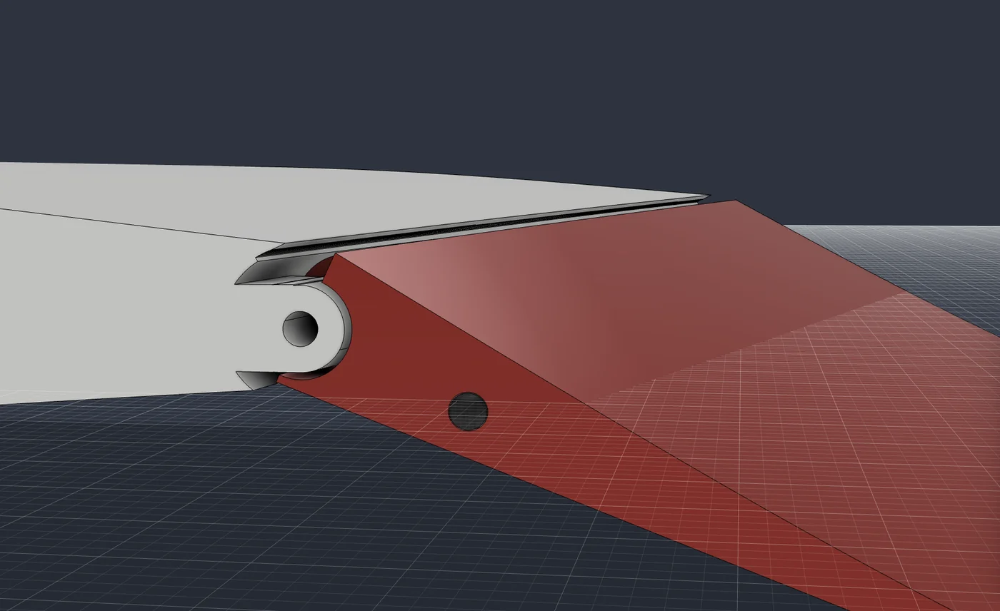</p>

### Every part checked for a way in, and for the printer
Each part was moved along the direction it actually has to travel and intersected with its neighbours. The wings go on in one straight spanwise move over the joiner, pin and magnets. For printing, each part got the best of ten candidate orientations, and any flat ceiling that remained was redesigned into a self-supporting shape.

<p align="center">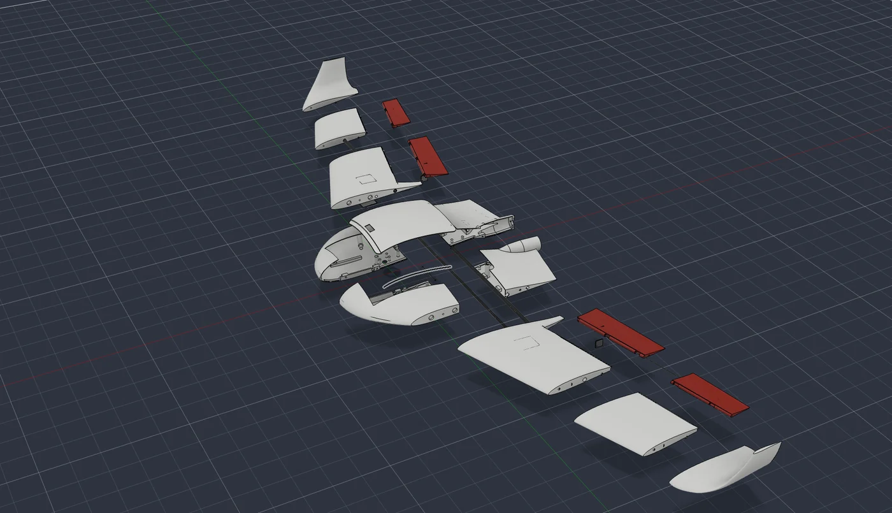</p>
<p align="center">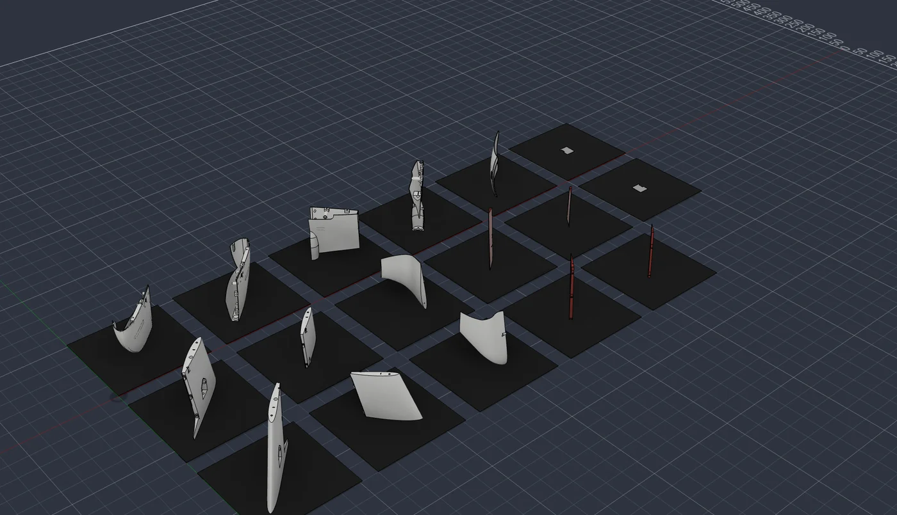 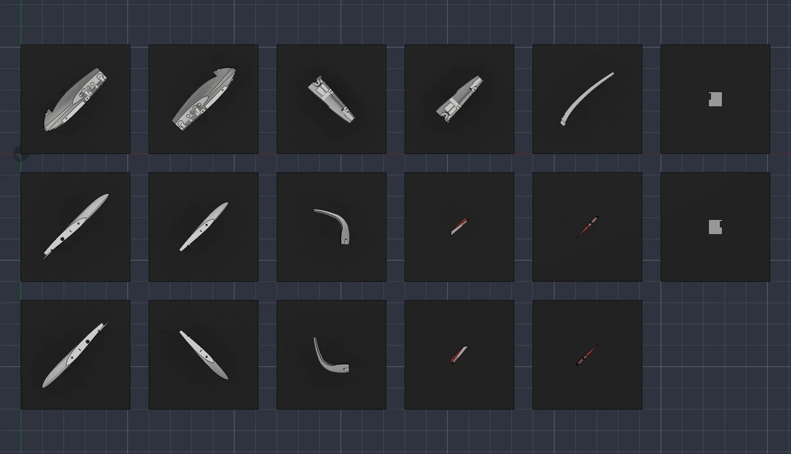</p>

### Aerodynamics
The CFD is a half-model RANS run in OpenFOAM (simpleFoam, k-ω SST, ≈0.8 M cells, 15 m/s).
- Lift is linear with CLα 0.071/deg.
- Neutral point at 83.3 mm, so the balance at 69.5 mm gives a 6.2% static margin.
- The blended winglet sheds one compact tip vortex, and drag is 4.6% lower than with plain fin winglets.

<p align="center">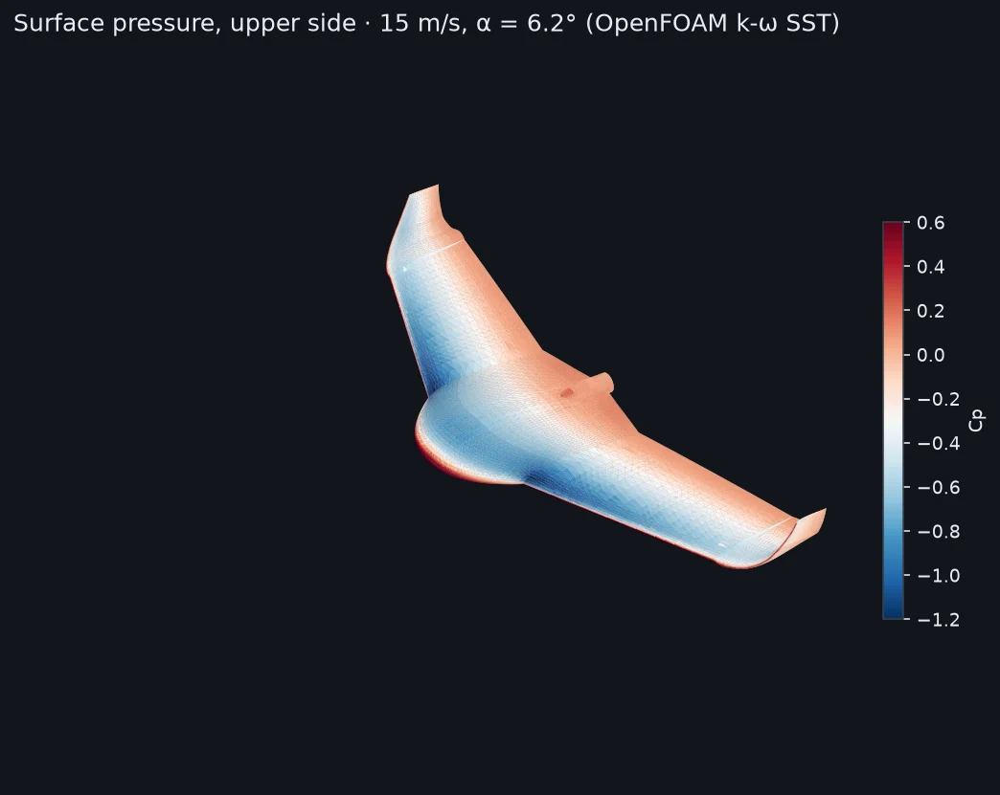 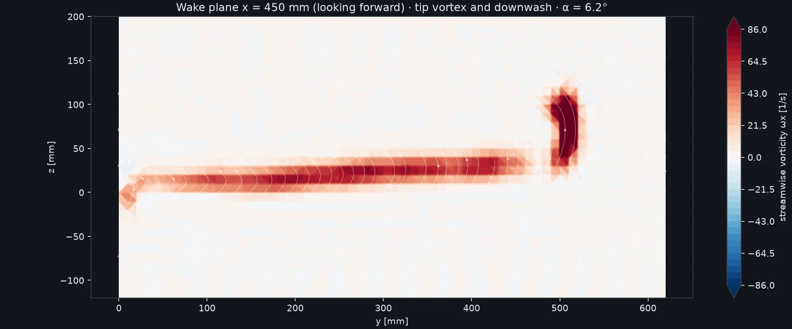</p>
<p align="center">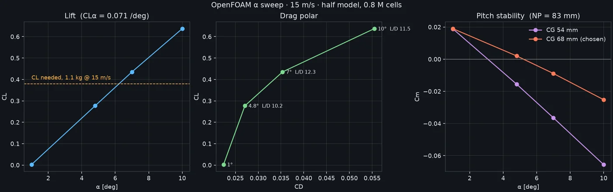</p>

## Gallery

| | |
|---|---|
| 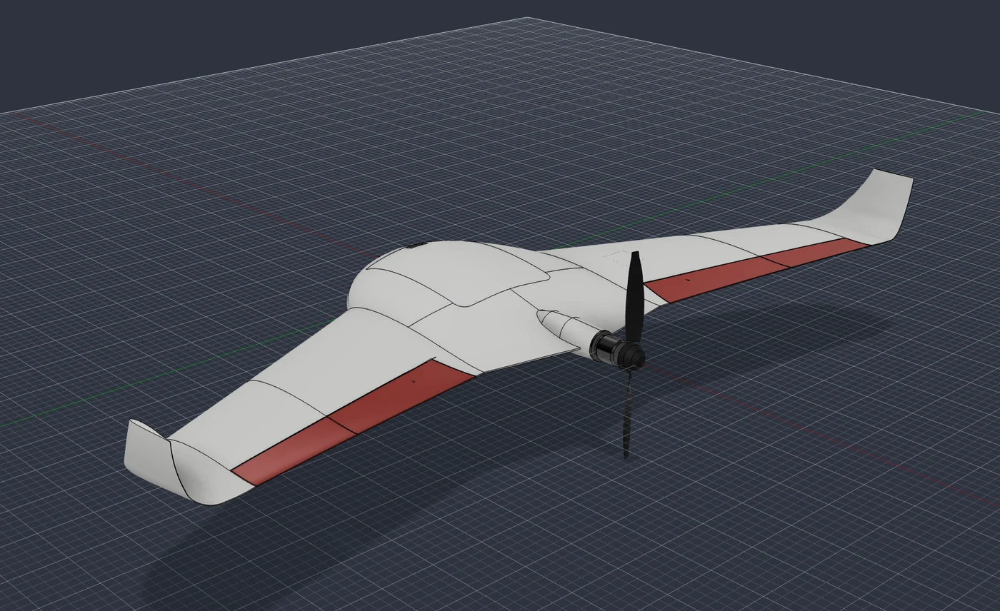 | 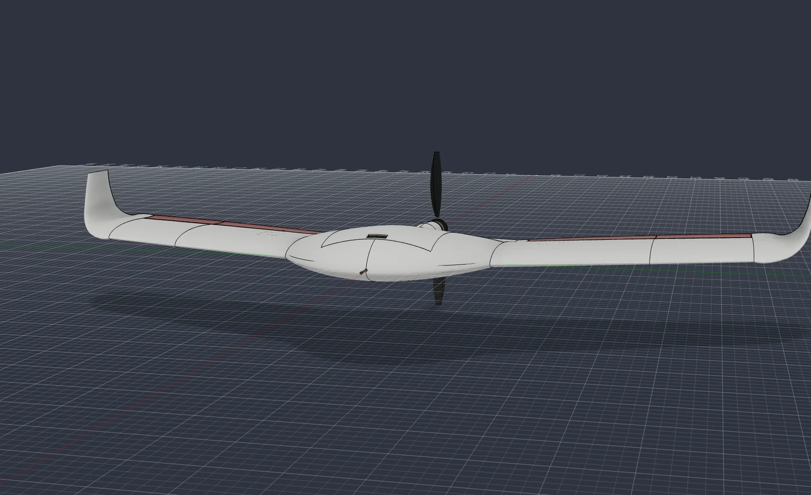 |
| 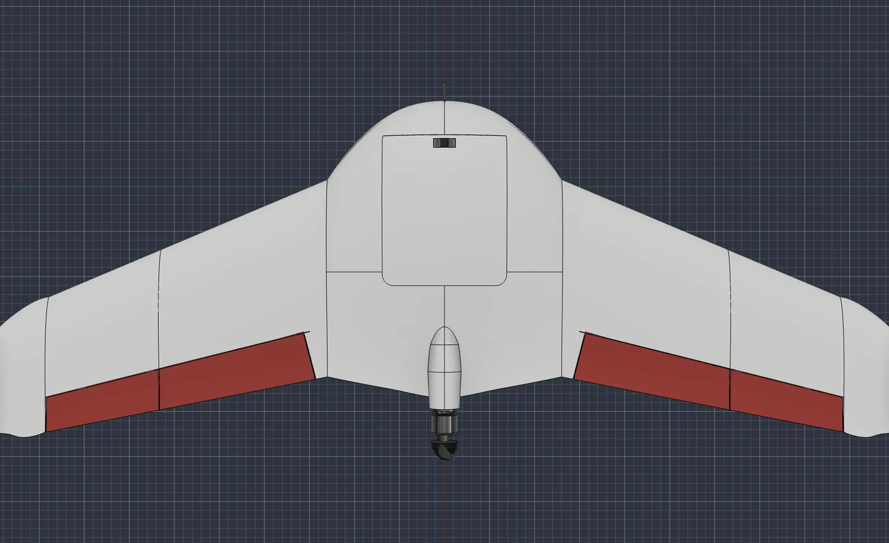 | 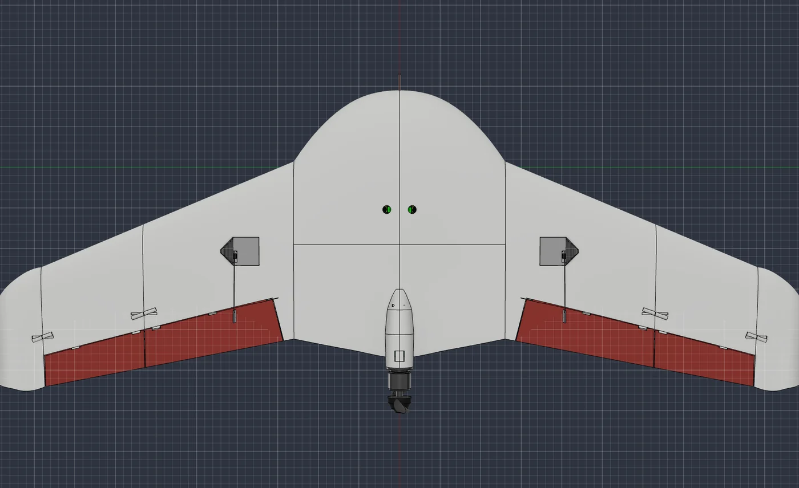 |
| 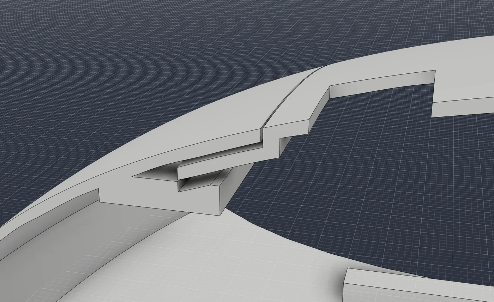 | 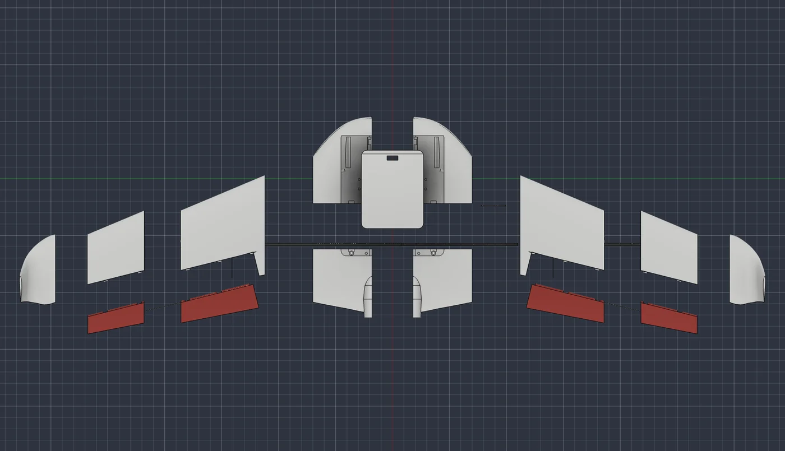 |

## Repository layout

```
cad/        AgriWing-100_RevD.step: assembly of this project's parts (printed + carbon + hardware envelopes)
stl/        17 print-ready STL files
docs/       the engineering dossier (served with GitHub Pages)
images/     renders and CFD images used here
analysis/   print plan, mass & balance, structural check, report builder, sizing and VLM trade studies
analysis/cfd/  OpenFOAM post-processing and the CFD summary
fusion/     Fusion 360 API scripts: Rev C build log and the Rev D rebuild (solid wings, hinge, joiner, print fixes)
tools/      helper to turn the dossier into a standalone page
```

## Build it

Quick references: [PRINTING.md](PRINTING.md) (per-part orientation, settings, time) and [BOM.md](BOM.md) (everything to buy). STLs as one zip: see [Releases](../../releases/latest).

1. **Print** the 17 STLs in LW-ASA (~0.6 g/cm³, enclosed printer) using the orientations in the dossier's *Print* section.
   - Wing parts: 2 walls, 6% gyroid.
   - Centre body and hatch: 3 walls, no infill.
2. **Buy** the parts:
   - Structure: Ø6 × 550 mm carbon rod, 2 × 8×6 carbon tubes (307 mm), Ø3 and Ø2 carbon rod, 1.5 mm G10 sheet, 10×3 N52 magnets, M3 heat-set inserts.
   - Electronics: Raspberry Pi 5, Camera Module 3 and NoIR, Matek H743-WLITE, M10Q GPS, ASPD-4525, SunnySky X2216, 40 A ESC, 2 × ES08MD II servos, 3S2P P45B pack.
3. **Assemble** as in the dossier's *Assembly* section: centre body and joiner first; then each wing (tube, W2, winglet, elevons, servo); then slide the wings on.
4. **Test** before flight:
   - Coupons.
   - A 4 g wing proof load.
   - Full ±25° elevon throw with both halves moving together.
   - A glide test at the design CG.

## Reproduce the analysis

```bash
python -m venv .venv && . .venv/bin/activate
pip install -r requirements.txt
cd analysis
python agw_mfg.py            # print plan: orientation, bed fit, overhang, mass, time
python agw_mass.py           # mass & balance, CG, static margin
python agw_struct.py         # structural checks at 6 g ultimate
python agw_build_report.py   # rebuilds the dossier into analysis/site/
```

## Third-party CAD

The Raspberry Pi 5, Camera Module 3, EMAX ES08A servo and 21700 cell models used for fit checks come from their manufacturers and [step.parts](https://www.step.parts). They are **not** redistributed here; download them from the original sources.

## Status and limits

- This is a design that has been analysed but **not flown yet**. The foamed LW-ASA allowables are assumptions until coupons are tested.
- The structural analysis is a hand beam-and-joint analysis, not FEM. The CFD is fully turbulent and has no propeller; plan on the lower endurance until a logged flight calibrates it.
- Fly within your local drone rules (weight class, altitude, line of sight) and with a failsafe configured.

## License

- Hardware design files (`cad/`, `stl/`, `docs/`, `images/`): **CERN-OHL-S v2** ([LICENSE](LICENSE)).
- Software (`analysis/`, `fusion/`, `tools/`): **MIT** ([LICENSE-MIT](LICENSE-MIT)).

See [LICENSING.md](LICENSING.md).

© 2026 Caio Lacerda
